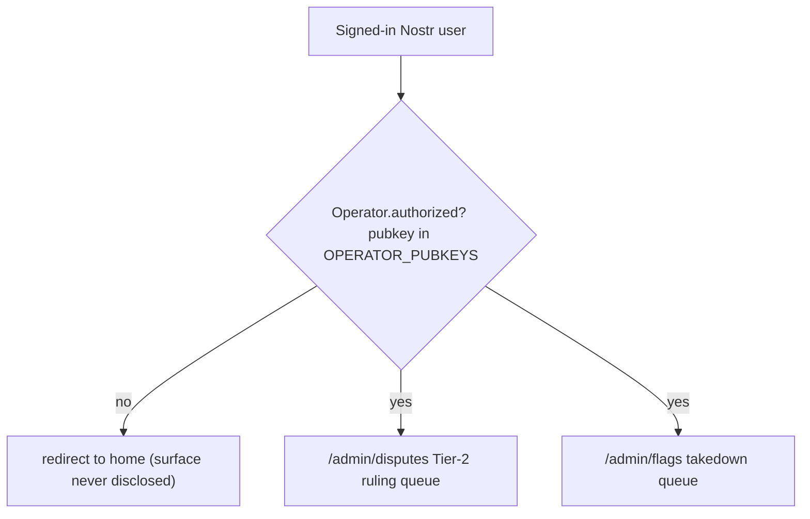
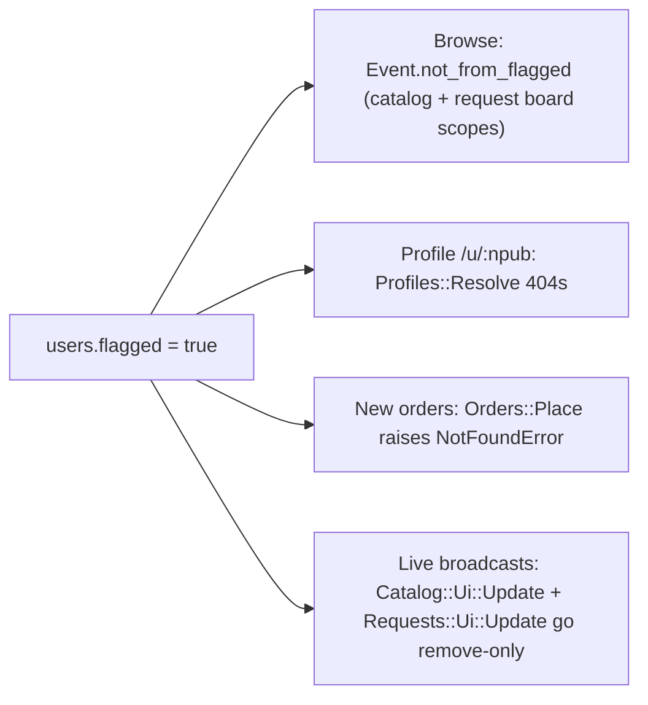
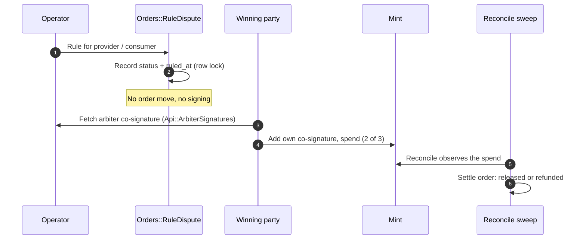

# Admin (operator) access

**An operator moderates content and rules disputes. An operator never touches funds, keys, or escrow.** The admin surface is a thin allowlist over a normal Nostr login: there is no password, no DB role, and nothing custodial.

## What an operator can and cannot do

| Can | Cannot |
| --- | --- |
| Hide a pubkey's public content (takedown) | Move, hold, or refund funds |
| Reverse a takedown (unflag) | See or hold any key, preimage, or token |
| Rule a Tier-2 dispute for one party | Settle an order directly (only the mint does that) |
| | Touch a Tier-1 order (no operator role at all there) |

Ruling a dispute only records an outcome. The order settles to `released`/`refunded` later, when the reconcile sweep observes the winning party's on-mint spend (`Orders::Settlement` reads the ruling for direction). The arbiter signature that completes that spend is fetched by the winning party over the authenticated channel (`Api::ArbiterSignatures`), never handled by the operator.

## The admin surface

Two pages, both under `app/controllers/admin/`, both gated by the same allowlist:



- **`/admin/disputes`** lists open disputes and rules one for a party (`Admin::DisputesController` -> `Orders::RuleDispute`).
- **`/admin/flags`** flags or unflags a pubkey (`Admin::FlagsController`).

### The auth gate

There is no admin password or role. An operator signs in with their normal Nostr key. Access is decided by `Admin::BaseController#require_operator`:

```ruby
redirect_to(root_path) unless signed_in? && Operator.authorized?(current_user.pubkey)
```

`Operator` (`app/models/operator.rb`) checks the pubkey against the `OPERATOR_PUBKEYS` allowlist built in `config/initializers/operators.rb` (comma-separated 64-hex, lowercased, validated). The list is empty by default, so the surface is closed until pubkeys are provisioned. A logged-out or non-operator visitor is quietly redirected home and is never told the surface exists.

## Takedown: hide a pubkey's public content

`/admin/flags` flags or unflags a pubkey. Paste an `npub…` or a 64-hex pubkey and Flag; Unflag reverses it. The flag is operator state on the `users` row (`users.flagged`), preserved across kind-0 re-projection. Flagging a pubkey we hold no profile for still works: a bare identity row is created to carry the flag (`User.find_or_create_by!`). Takedown **never touches funds or escrow**.

A single flag, checked through `User.flagged?`, hides the author everywhere:



- **Browse** stops serving the author's service listings and open requests (`Event.not_from_flagged` on the catalog and board scopes).
- **Profile** `/u/:npub` returns 404 (`Profiles::Resolve` raises `RecordNotFound` for a flagged identity).
- **New commerce** is blocked: a flagged author's coordinate is unorderable, not just hidden, because `Orders::Place` calls `User.flagged?` (and `by_coordinate` bypasses the `not_from_flagged` browse scope).
- **Live broadcasts** turn remove-only: `Catalog::Ui::Update` and `Requests::Ui::Update` push a remove for a flagged author's card to every open catalog/board.

Note: takedown applies at the next read. A board already open keeps the stale card until reload (the live broadcast handles freshly published cards, not ones already on screen). Author-requested deletion of published content is a separate path: NIP-09 (a kind-5 deletion removes the same-author events it references, and a deleted kind-0 erases the projected profile).

## Disputes: rule, do not settle

Ruling is recorded by `Orders::RuleDispute`. It is deliberately narrow:

- It records the outcome on the dispute only (`status` + `ruled_at`), under a row lock.
- It does **not** move the order. `disputed → released|refunded` lands later via the reconcile sweep, using the ruling for direction.
- It does **not** sign. The winning party fetches the arbiter signature afterward.
- A ruling is final: re-ruling the same way is a no-op; flipping it to the other party is rejected (funds may already be moving on the first ruling).



## Stuck-escrow alerts (no operator action moves funds)

The reconcile sweep (`Escrow::ReconcileSweepJob`, every minute per `config/recurring.yml`) re-checks every settleable order (`funded`, plus a Tier-2 order in `disputed`) against the mint. It retries a dead or unresponsive mint forever, but it can never recover a vanished mint and it never escalates on its own.

`Escrow::StuckAlert` (`config/recurring.yml` -> `every hour at minute 41`) is the operator signal for escrow that has gone quiet: a settleable order sitting past `locktime` by more than the grace window, neither redeemed nor refunded. It logs a warning the monitoring vendor escalates, returns the stuck orders, and **never mutates an order**. The grace window is `ESCROW_STUCK_GRACE_SECONDS` (default `86400`, 1 day). Even here, an operator has no lever to move the money: a stuck order is a mint or party problem, not something the platform can custodially resolve.

## Log in as admin (local)

1. **Get your account's 64-hex pubkey** (not the npub). Either:
   - convert your npub: `bin/rails runner 'puts Nostr::Bech32.decode("npub1…")[1]'`, or
   - sign in to the app once, then read it: `bin/rails runner 'puts User.order(:updated_at).last.pubkey'`.
2. In `.env`, set the allowlist (comma-separated for multiple operators):
   ```
   OPERATOR_PUBKEYS=<your-64-hex-pubkey>
   ```
   To exercise the whole dispute flow, also enable Tier-2 with any 64-hex key (`ESCROW_TIER2_ARBITER_PRIVKEY`, read by `Escrow::ArbiterSigner`):
   ```
   ESCROW_TIER2_ARBITER_PRIVKEY=1111111111111111111111111111111111111111111111111111111111111111
   ```
3. **Restart** the server (`bin/dev`); env vars load at boot.
4. Sign in normally (browser extension, remote signer, or pasted nsec) as that account.
5. Visit `http://localhost:3000/admin/disputes`.

## Seed a dispute to rule (so the queue is not empty)

Open `bin/rails console` and paste:

```ruby
order = Order.create!(
  entry_point: Orders::EntryPoints::CATALOG_ORDER, current_state: Orders::States::AWAITING_FUNDING,
  tier: Orders::Tiers::TIER2_ARBITER, amount_sats: 1_000,
  listing_coordinate: "30402:#{SecureRandom.hex(32)}:demo", mint_url: "http://127.0.0.1:3338",
  dedupe_key: SecureRandom.hex(16), funding_deadline_at: 1.hour.from_now,
  consumer_pubkey: SecureRandom.hex(32), provider_pubkey: SecureRandom.hex(32),
)
order.state_machine.transition_to!(Orders::States::FUNDED)
Orders::OpenDispute.call(order:, opened_by_pubkey: order.consumer_pubkey, reason: "Work never delivered (demo)")
```

Reload `/admin/disputes`: the dispute appears with **Rule for provider** / **Rule for consumer** buttons. Ruling only records the outcome; the order settles to released/refunded later, when the winning party's on-mint spend is observed (the operator never holds funds or keys).

## Run the automated tests

```
# operator gating + ruling action (no mint needed)
bin/rails test test/controllers/admin/disputes_controller_test.rb
bin/rails test test/services/orders/rule_dispute_test.rb

# end-to-end through the real order page + admin surface (needs the local nutshell mint up at :3338)
bin/rails test test/system/order_tier2_page_test.rb
```

> The local nutshell mint rate-limits (HTTP 429) under repeated runs; if the system tests skip or fail with a 429, give it a minute to cool down. Run one-off `bin/rails runner`/`console` with `RAILS_ENV=test` when you want the test DB (this app is Postgres-only; never create a sqlite file).