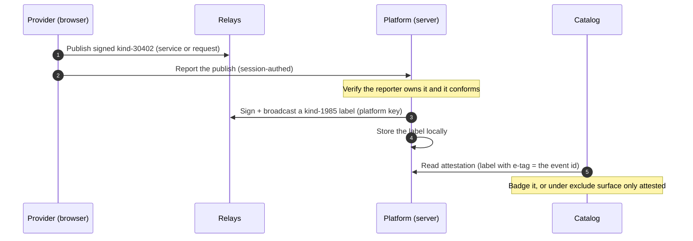

# Platform attestation

**The hosted platform vouches for what it published by signing a NIP-32 label over the listing's coordinate. The catalog then badges (or, strictly, surfaces only) attested items, so a fork cannot fake "Listed on Switchboard".** It applies to both services and open requests (both are kind-30402).

## Flow



## Pieces

- `Attestation::Issue` (service): signs the kind-1985 label, broadcasts it, and upserts it locally. Idempotent per event id.
- `Attestation::Attest` (service): the interim trigger. Verifies a reported publish is the reporter's own conforming kind-30402, then issues.
- `Attestation::Policy`: config + read facade (`policy`, `issuer_pubkey`, `attested?`, `mark`, `surfaceable?`).
- `Attestation::IssuerIdentity` (concern) on `Attestation::Issuer`: the signing identity (key private, signs via `Events::Sign`).
- `Attestation::Attestable` (concern): adds `attested?` to `Catalog::Listing` and `Requests::OpenRequest`.

## The label (kind 1985)

Tags: `["L", namespace]`, `["l", "listed", namespace]`, `["a", coordinate]`, `["e", event_id]`. The namespace is env-scoped (`switchboard`, suffixed off prod). Reads match on the `e` tag (the exact event id), so editing a listing drops the badge until it is re-attested, closing the silent-swap hole.

## Policy: an operator default, a viewer override

Attestation is a **per-viewer view**, not a hard server filter. The operator policy only sets the *default* view; each viewer chooses for themselves (so they can discover non-platform listings or limit themselves to attested ones). The policy is one of:

- `off`: feature disabled. No badges, no filter; the catalog is fully open.
- `badge`: visitors default to seeing everything, with attested items badged.
- `exclude` (default): visitors default to verified-only.

`badge` and `exclude` differ only in the default of the viewer's filter; both show badges and the filter. The policy resolves at request time with precedence: the operator's persisted choice, then the `ATTESTATION_POLICY` env value, then the default (`exclude`). It only matters when an issuer key is configured: with no issuer, `enabled?` is false and everything surfaces, no badge, no filter.

## Where filtering happens

The server never hard-hides unattested items (a viewer must be able to reveal them). `Catalog::Search` / `Requests::Search` return all active items and tag the attested ones (`Attestation::Policy.mark`); each card carries `data-attested`. The catalog's Stimulus controller hides unattested cards when the viewer's filter is "verified", and the same applies to cards streamed in live. So the filter is instant, reload-free, and works with the public (viewer-agnostic) broadcast.

## Controls

- **Operator default** at `/admin/settings` (operator-gated, `OPERATOR_PUBKEYS`), persisted as a single `AttestationSetting` row that `Attestation::Policy` reads ahead of the env/default fallback.
- **Viewer filter** on the catalog/board (All vs Verified). The choice is remembered in a cookie for anyone (the cookie wins so a failed account save never reverts the viewer); a signed-in viewer also saves it as their account default (`users.catalog_view`, editable under Settings -> Browsing). Resolution for a viewer: their cookied choice, then the saved account default, else the operator default.

## Backfill

The interim trigger only attests new publishes, so the default (`exclude`) would hide listings published before attestation shipped. Run the one-time, idempotent backfill once to attest existing conforming listings/requests so the verified default does not show an empty catalog:

```
bin/rails attestation:backfill
```

## Trigger

- **Now:** a session-authenticated report from the studio (services) and the request form (requests) calls `Attestation::Attest`. Same standard as the rest of those flows, not a separate API.
- **Eventual:** the listing fee, paid as a Nostr payment to the platform npub, observed via relay-ingest. Gated by `ATTESTATION_REQUIRE_FEE` (the fee check lands with the payments work; until then requiring a fee attests nothing).

## Trust and self-hosting

The platform signs its OWN label, never a user key (the non-custodial invariant). Everything is config (`ATTESTATION_PRIVATE_KEY`, defaulting to R_op; `ATTESTATION_PUBKEY` to verify another issuer; namespace; policy), so a self-hoster runs their own issuer and policy.
