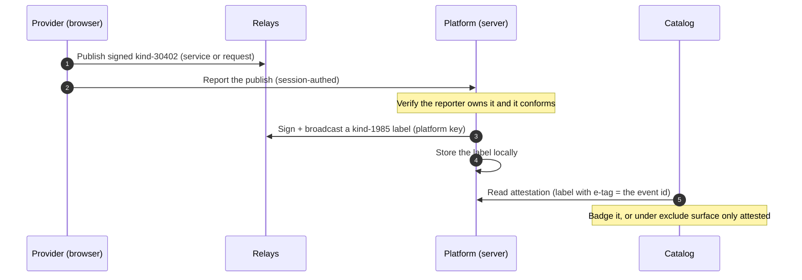

# Platform attestation

**The hosted platform vouches for what it published by signing a NIP-32 label over the listing's coordinate. The catalog then badges (or, strictly, surfaces only) attested items, so a fork cannot fake "Listed on Switchboard".** It applies to both services and open requests (both are kind-30402).

## Flow

## Pieces

- `Attestation::Issue` (service): signs the kind-1985 label, broadcasts it, and upserts it locally. Idempotent per event id.
- `Attestation::Attest` (service): the interim trigger. Verifies a reported publish is the reporter's own conforming kind-30402, then issues.
- `Attestation::Policy`: config + read facade (`policy`, `issuer_pubkey`, `attested?`, `mark`, `surfaceable?`).
- `Attestation::IssuerIdentity` (concern) on `Attestation::Issuer`: the signing identity (key private, signs via `Events::Sign`).
- `Attestation::Attestable` (concern): adds `attested?` to `Catalog::Listing` and `Requests::OpenRequest`.

## The label (kind 1985)

Tags: `["L", namespace]`, `["l", "listed", namespace]`, `["a", coordinate]`, `["e", event_id]`. The namespace is env-scoped (`switchboard`, suffixed off prod). Reads match on the `e` tag (the exact event id), so editing a listing drops the badge until it is re-attested, closing the silent-swap hole.

## Policies

`ATTESTATION_POLICY` is one of:

- `off`: feature disabled.
- `badge` (default): show everything, mark the attested ones.
- `exclude`: the public catalog/board surface only attested items (a poster still sees their own under My-requests).

## Trigger

- **Now:** a session-authenticated report from the studio (services) and the request form (requests) calls `Attestation::Attest`. Same standard as the rest of those flows, not a separate API.
- **Eventual:** the listing fee, paid as a Nostr payment to the platform npub, observed via relay-ingest. Gated by `ATTESTATION_REQUIRE_FEE` (the fee check lands with the payments work; until then requiring a fee attests nothing).

## Trust and self-hosting

The platform signs its OWN label, never a user key (the non-custodial invariant). Everything is config (`ATTESTATION_PRIVATE_KEY`, defaulting to R_op; `ATTESTATION_PUBKEY` to verify another issuer; namespace; policy), so a self-hoster runs their own issuer and policy.
