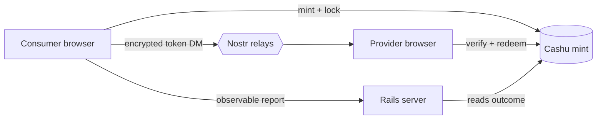
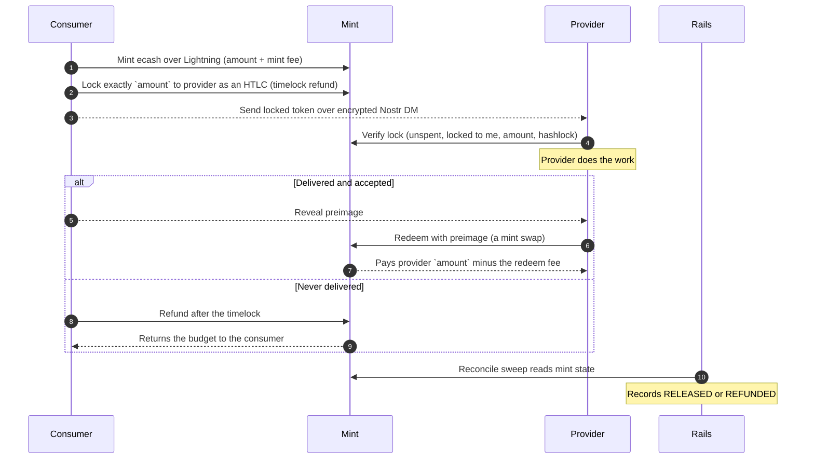
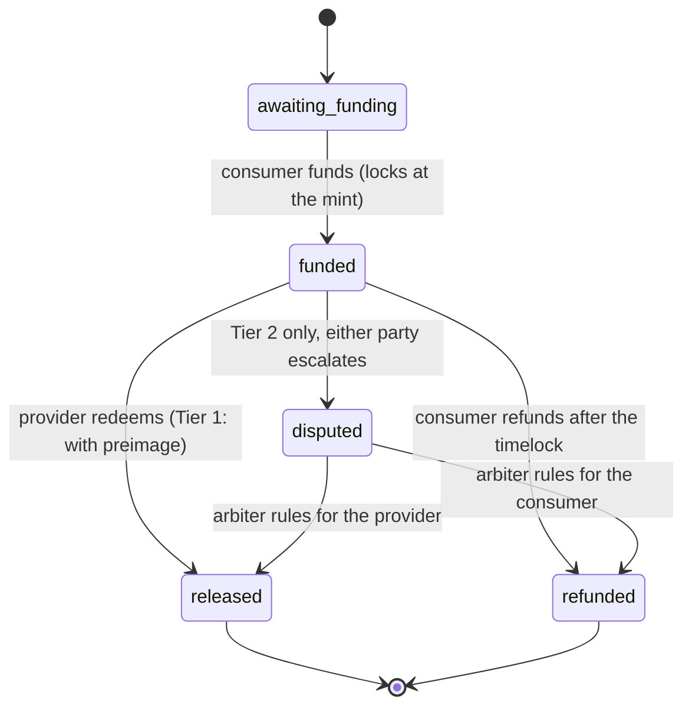
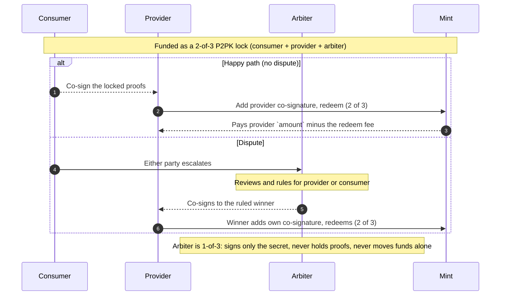

# How escrow works in Switchboard

**Principle: the platform never holds your money.** Funds are locked at a Cashu mint by cryptographic rules. Only the consumer and provider (and, for disputes, a co-signing arbiter) can move them. The Rails server records only what it can observe, never a key or a spendable token.

## The pieces

- **Browser (both parties):** holds all keys, mints the ecash, signs the locks and unlocks. The money path lives entirely here.
- **Cashu mint (vetted, currently Coinos):** issues the ecash and enforces the lock (hashlock, timelock, required signatures). It holds the backing sats while an order is locked.
- **Rails server:** records observable order state and runs a reconcile sweep that reads the mint to learn the outcome. It never sees keys, preimages, proof secrets, or tokens.
- **Nostr relays:** carry the signed listings/requests, and the encrypted (NIP-17) hand-off of the locked token between the two parties.

## Lifecycle (Tier 1, the default)

The **mint** decides the outcome; Rails only observes it.

## Order states

## Two tiers

- **Tier 1 (NUT-14 HTLC), default.** Consumer-gated and fully self-custodial: the provider can only redeem with the consumer's preimage, and the consumer can refund after the timelock. No third party. Cap ~100k sat.
- **Tier 2 (NUT-11 P2PK 2-of-3 arbiter), opt-in for subjective work.** The lock needs 2 of 3 signers: consumer, provider, platform arbiter. Lower cap (~25k sat) and a longer minimum locktime so a dispute has time to resolve.

## What the server stores vs never sees

- **Stored (observable, non-spendable):** order amount, mint URL, proof Y-values (hashes), hashlock, locktime, public keys, state.
- **Never:** private keys, preimages, proof secrets, or the spendable token. All of that stays in the browser.

## Fees and amounts

The lock is the full order amount, but redeeming it is itself a mint swap, so the provider does **not** receive the full amount.

- **Consumer pays:** the order amount plus the mint's swap fee for the lock (itemized before they pay).
- **Locked to the provider:** exactly the order amount.
- **Provider receives:** the order amount **minus the mint's redeem swap fee**. If they then cash the ecash out to Lightning, the mint takes a further small melt fee.
- **No platform cut at any step.** Every fee belongs to the mint, not to Switchboard.

## The one trust assumption

The mint custodies the backing sats while an order is locked, so a dead or dishonest mint is the real risk, not the platform. This is mitigated by a vetted mint allowlist (currently Coinos) and disclosed to users at funding. Keep amounts modest while the platform is young.
