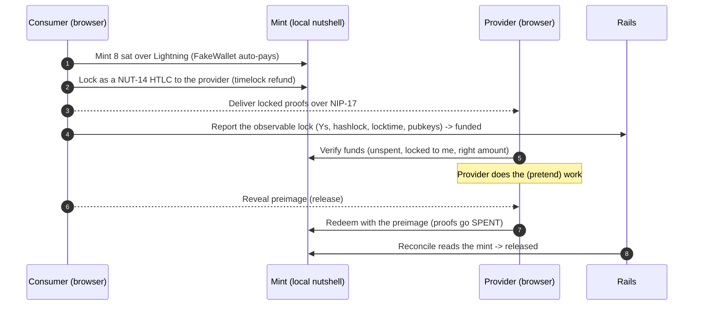

# Escrow: local end-to-end testing

**Run the full escrow money path on your own machine against a real (but fake-money) Cashu mint.** The browser does every Cashu step (mint, lock, deliver, reveal, redeem, refund). Rails only records what it can observe and reconciles the outcome from the mint. Nothing custodial happens on the server (see `docs/escrow-architecture.md`, "What the server stores vs never sees").

## What you exercise

The happy path `awaiting_funding -> funded -> released`, and the timeout path `funded -> refunded`.



Step by step:

1. **Provider** publishes a service listing. Publishing also publishes their NIP-61 `kind:10019` escrow key, so the consumer can discover the P2PK key to lock to.
2. **Consumer** orders the listing, then funds: mints ecash over Lightning, locks it as a NUT-14 HTLC to the provider with a timelock refund, backs up the unlock material, delivers the locked proofs to the provider over NIP-17, and reports only the observable lock (Y values, hashlock, locktime, pubkeys) to Rails. The order goes to `funded`.
3. **Provider** verifies the locked budget, does the work, and redeems after the consumer releases.
4. **Consumer** releases by revealing the preimage; or, after the locktime, refunds.
5. Rails' reconcile reads the mint, sees the proofs SPENT, and settles the order to `released` or `refunded`. Both order pages update live over Turbo Stream.

## Prerequisites

- **A local Cashu mint at `http://127.0.0.1:3338`**, the same nutshell FakeWallet mint the Cashu system tests use. It must run the `FakeWallet` bolt11 backend (invoices auto-pay, no real Lightning), have fees off, and support NUT-7/10/11/12/14. Representative launch (match the image tag to your nutshell):
  ```sh
  docker run --rm -p 3338:3338 \
    -e MINT_BACKEND_BOLT11_SAT=FakeWallet \
    -e MINT_LISTEN_HOST=0.0.0.0 -e MINT_LISTEN_PORT=3338 \
    -e MINT_INPUT_FEE_PPK=0 \
    -e MINT_PRIVATE_KEY=TEST_PRIVATE_KEY \
    cashubtc/nutshell poetry run mint
  ```
  Verify it answers: `curl -s http://127.0.0.1:3338/v1/info` returns JSON. The non-prod CSP (`config/initializers/content_security_policy.rb`) already allows this origin, and the escrow allowlist (`config/initializers/escrow.rb`) already trusts `127.0.0.1:3338` / `localhost:3338` outside production.
- **The app** running with `bin/dev` (web + css + jobs + the local relay, from `Procfile.dev`). Default port `3000`.
- **Two separate browser profiles** (or one normal window plus one incognito), one for the provider and one for the consumer. Each party needs its own signer and IndexedDB, which are per-browser-per-origin. Two tabs in the same profile share storage and cannot be two different accounts.
- **Two test keys.** Sign in with the **Private key** option and paste a test `nsec` in each profile (no browser extension needed). Use a different `nsec` per profile.

## Option A: the automated cross-language test (fastest)

This proves the whole money path against the real mint in one command, with no clicking:

```sh
bin/rails test test/system/order_lifecycle_test.rb
```

It funds and locks in the browser, feeds the report to the real `Orders::Funding` (which checkstates the Ys at the mint), has the provider verify and redeem, runs `Orders::Reconcile`, and asserts the order reaches `released`. It also covers the consumer-refund path through `order_settlement`. The test **skips cleanly if the mint is down**, so a green run means the mint was up and the e2e held.

The narrower escrow primitive and its negatives (lock, block-redeem-without-preimage, release, refund, idempotent re-redeem, the fee top-up solver) live in their own merge-gate test, also skip-on-no-mint:

```sh
bin/rails test test/system/cashu_escrow_test.rb
```

The funding and handshake pieces have focused tests too:

```sh
bin/rails test test/system/order_funding_test.rb test/system/order_funding_backup_test.rb \
  test/system/escrow_messages_test.rb test/system/escrow_identity_test.rb test/system/escrow_identity_relay_test.rb
```

These are importmap system tests (Capybara + headless Chrome). They load the test-only bridge `app/javascript/test_support/cashu_test_support.js` (pinned as `nostr/cashu_test_support` outside production, never in prod) straight from the page import map, so there is no separate asset-build step to run first. Point them at a different mint with `CASHU_MINT_URL`.

## Option B: manual two-browser walkthrough

### 1. Provider: publish a listing (enables escrow receiving)

In the **provider** profile: sign in, open **Provider studio -> New**, fill a listing with a **whole-sat, fixed price** (for example `8`) and **Publish**. Publishing also publishes the provider's `kind:10019` escrow key in the background, so the consumer can lock to it. Only whole-sat, fixed-price listings are directly orderable; per-hour or non-sat listings show an inert CTA.

### 2. Consumer: order and fund

In the **consumer** profile: sign in, open the catalog (home), click the provider's listing, and click **Order this service**. You land on the order page (`/orders/<id>`) showing **Awaiting funding**.

Click **Fund escrow**. The flow: ensure your escrow key, discover the provider's key, mint `8` sat over Lightning (the FakeWallet mint auto-pays the displayed invoice), lock the HTLC, back up `{token, preimage}` locally and as an encrypted self-DM, deliver the locked proofs to the provider over NIP-17, and report the lock to Rails. The status flips to **Funded, in escrow**.

### 3. Provider: verify (then redeem after release)

In the **provider** profile, open the same order by id: `/orders/<id>`. Get the id with `bin/rails runner 'puts Order.last.id'`, or have the consumer share the URL.

Click **Verify funds**. It decodes the delivered proofs and confirms they are unspent at the mint, locked to your key, with the order's hashlock and a future locktime. Do the (pretend) work and deliver it to the consumer out of band.

### 4. Consumer: release

Back in the **consumer** profile on the order page, click **Release escrow**. This reveals the preimage to the provider over NIP-17. Release must be done on the device you funded from, because the preimage lives in that browser's local backup.

### 5. Provider: redeem

In the **provider** profile, click **Redeem**. It fetches the revealed preimage and the delivered proofs and swaps them at the mint with your escrow key. The proofs are now SPENT, and their witness reveals the preimage (the "released" signal the runtime reads).

### 6. Settle

Rails settles from the mint, not from any browser call. **In development the reconcile sweep does not run automatically** (it is scheduled in production only), so trigger it once:

```sh
bin/rails runner 'Orders::Reconcile.call(order: Order.last)'   # or: Order.find("<id>")
```

Reconcile checkstates the proofs, sees them SPENT with a preimage matching the hashlock, and transitions the order to **released**. Both open order pages update live over Turbo Stream.

### Refund path (timeout)

The default HTLC locktime is 7 days (`ESCROW_DEFAULT_LOCKTIME_SECONDS`), too long to wait. Restart the app with a short locktime:

```sh
ESCROW_DEFAULT_LOCKTIME_SECONDS=60 bin/dev
```

Fund an order as above, wait about 60 s, then on the consumer's order page click **Refund** (it reclaims the backed-up token with your refund key). Trigger reconcile again. With the proofs SPENT but no preimage in the witness, the order settles to **refunded**.

### Variant: fund via an open request (claim)

The same escrow, entered from the demand side. Here the **request author is the consumer** and the **claimer is the provider**:

1. **Author** (consumer profile): **Post a request** with a whole-sat budget (for example `8`).
2. **Claimer** (provider profile): open the request on the board and click **Claim this request**. This publishes the claimer's escrow key (escrow is ensured *at claim time*) and places a `request_claim` order. You land on the order page showing **Awaiting funding** (the claimer waits for the author to fund).
3. **Author** (consumer profile): open the order (`/orders/<id>`) and click **Fund escrow**. It locks the budget to the claimer, exactly as in the catalog flow.
4. From here it is identical: claimer **Verify funds**, author **Release escrow**, claimer **Redeem**, then reconcile (step 6 above) settles to **released**.

A request author cannot claim their own request (the claim CTA is disabled for them), and only open, whole-sat requests are claimable.

## How it works and caveats

- **FakeWallet auto-pays** the mint invoice, so no real Lightning payment happens. The invoice is still displayed; in production a real wallet would pay it before minting proceeds.
- **Dev reconcile and expiry are manual.** `config/recurring.yml` schedules the reconcile and expiry sweeps under `production:` only. In dev, run settlement by hand with `Orders::Reconcile.call(order:)`, or expire overdue unfunded orders with `Escrow::ExpireSweepJob.perform_now` (it re-scans `Order.funding_due` itself).
- **Non-custodial.** The escrow private key, the HTLC preimage, and the full Cashu token never leave the browser. Rails stores only the proof `Y` values, the hashlock, the locktime, and the P2PK pubkeys.
- **Separate browsers are mandatory.** The signer (localStorage) and escrow keys (IndexedDB) are per-browser.
- **Listing constraints gate the Order button.** The provider's listing must be whole-sat and fixed-price, and a mint must be allowlisted (`config/initializers/escrow.rb` allows the local mint outside production), or the **Order** button stays inert.

## Troubleshooting

- **"The provider has not enabled escrow payments yet."** The provider's `kind:10019` is not on the relays. Re-publish a listing in the provider profile (publishing re-publishes the escrow key), and confirm `bin/dev`'s `relay` process is up.
- **Funding hangs on the invoice.** The mint is not the FakeWallet backend (a real backend will not auto-pay). Confirm `MINT_BACKEND_BOLT11_SAT=FakeWallet` and that `curl http://127.0.0.1:3338/v1/info` lists NUT-7/11/14 support.
- **Order never leaves "Funded".** Run the reconcile command in step 6; there is no automatic sweep in dev.
- **Release or refund says the secret is not on this device.** Use the same browser profile that funded the order. The unlock material is in that profile's IndexedDB (and its encrypted self-DM backup).