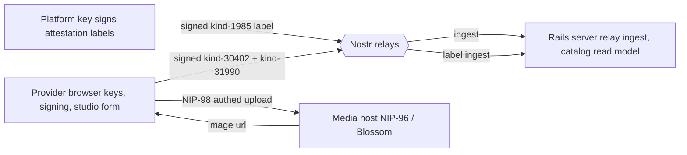
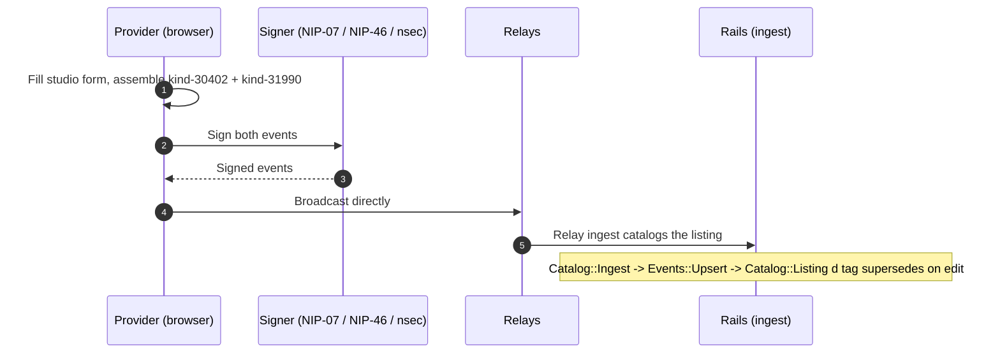
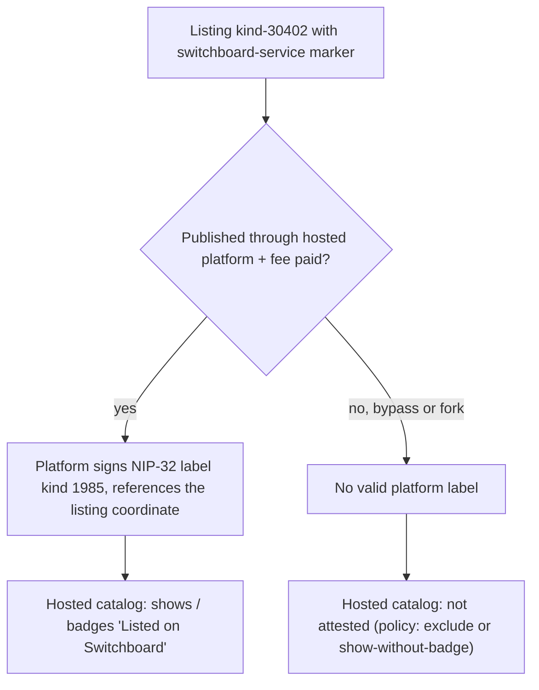

# Listing architecture: publishing and platform attestation

**A service listing is a self-describing Nostr event the provider signs in their own browser. The server only catalogs what it observes, never the provider's key, and the hosted platform asserts curation with a separate signed label, not by gating the open protocol.**

This is the catalog-side counterpart to `messaging-architecture.md` and `escrow-architecture.md`. It covers three things: the wire format a listing must carry, how a provider publishes one without giving the server custody, and how Switchboard marks the listings it curates on a protocol anyone can fork.

## The pieces

- **Provider browser:** holds the provider's key, fills the studio form, assembles and signs the events, broadcasts them. The publish path lives here.
- **Nostr relays:** carry the signed listings and the platform's attestation labels.
- **Rails server:** ingests events off relays into a catalog read model, and surfaces the attested listings. It never holds a provider's key and never creates a listing on the provider's behalf.
- **Platform key:** signs the curation labels (separate from any provider key).
- **Media host:** a third-party host for listing images, authorized by the user's own signer.

## The service-listing microstandard

A service is a standing **NIP-99 classified listing** (kind 30402). It carries a tight, documented set of tags (brief 7.1) so any third-party client can render and invoke it from the convention alone. The listing is the storefront; the work happens off-platform, at a provider endpoint or by a human.

| Field | Wire | Notes |
| --- | --- | --- |
| Service name | NIP-99 `title` | required to publish |
| Description | event `content` | Markdown |
| Capability | NIP-32 `["l", value, "service.capability"]` | the queryable capability label (the intent router uses it). The reader stays lenient (any namespace ending in `capability`); the publisher and draft emit the canonical `service.capability`. The "svc:" prefix some UIs show is display text only, not part of the tag |
| Price | NIP-99 `["price", n, "sat", frequency?]` | sat-only in v1; optional 4th element is a recurring frequency ("hour" = per hour, absent = per request) |
| Input schema | one `["input_schema", <JSON array>]` | a JSON array of field objects, in a single tag (never one tag per field). Each field has a machine `name`, a human `label`, a `type`, and `required` (a real JSON boolean) |
| Fulfillment mode | `["fulfillment", "automated"\|"manual"]` | how the order is delivered, not a trust level |
| Endpoint (automated) | `["endpoint", url]` | where the runtime would forward each paid request |
| Delivery window (manual) | `["delivery_window", "24h"\|"3d"]` | sets the acceptance deadline clock (brief 10.1) |
| Image | NIP-99 `image` / NIP-92 `imeta` | the listing's hero image; only `http(s)` urls are read |
| Marker | `["t", "<namespace>-service"]` | the disambiguator that makes the catalog cleanly queryable |
| d / published_at / status | NIP-99 standard | `d` is the addressable id; re-publishing under the same `d` supersedes. `status` toggles visibility (see below) |

There is deliberately **no payment-policy field**: escrow is a universal, platform-set guarantee on every transaction (brief 10), never declared per listing.

The read side of this format is `Events::Nip99Presentation` (shared with open requests) plus `Catalog::Listing` (the listing's own vocabulary: pricing basis, fulfillment, input schema). The write side is `Catalog::Draft` (the in-browser preview) over the shared `Events::Draftable` builder, mirroring the canonical wire format that `listing_publish.js` signs. Every accessor tolerates absent or malformed tags.

### Automated is declared but not yet orderable

`fulfillment` describes how delivery happens, not whether you can trust the provider. Two values are defined:

- **`manual`:** a human delivers within `delivery_window`. This is the orderable path today.
- **`automated`:** the runtime would forward each paid request to `endpoint`. There is no dispatcher yet, so an **automated listing cannot actually be ordered**. `Catalog::Listing#automated?` is the single rule both the buyer UI and the server order path read, so neither lets an automated order through. Listing one is honest about it: it advertises a capability, it is not yet a checkout.

### Only a fixed whole-sat price is orderable

Escrow locks whole sats, so a listing is orderable only if it has a fixed, positive, whole-sat price. `Catalog::Listing#whole_sat_price?` is the one rule for this, read by both the buyer-side order gate and the server enforcement (`Orders::Place`), so the UI and the server can never drift. A fractional, zero, or non-sat price renders but cannot be ordered.

### Visibility: active vs unpublished

`status` controls whether a listing shows in the public catalog. Unpublishing does not delete anything; it **re-publishes the same `d` coordinate with `status="inactive"`**. `Catalog::Listing#active?` is `status == "active"`. `Catalog::Search` drops unpublished rows (`status="inactive"`) in SQL so the `limit` applies to visible listings, not starved by a backlog of unpublished ones, and then keeps only `active?` listings (also dropping other non-active statuses such as NIP-99 "sold"). Open requests share kind 30402 and are excluded from the catalog by their own marker, so the demand board never bleeds into the supply catalog.

### Environment-scoped marker

The marker tag is environment-scoped so development, staging, and test listings never pollute the production catalog. Production uses the bare marker `switchboard-service`; non-production environments use a suffixed form (for example `switchboard-service-development`). It lives in one place, `Catalog::Listing.marker` (derived from `BASE_MARKER` plus the Rails env), and is used by the publisher, the catalog query, and `conforms?`. The base value is still a placeholder pending the project name (brief 14.1 / 14.3), with a re-key plan for when it is finalized.

## Publishing is non-custodial

A provider publishes from the browser, signing with their own key. The server never holds a provider's key and never creates the listing on their behalf.

1. The provider fills the studio form; the browser assembles a conforming kind-30402 plus a NIP-89 handler announcement (kind 31990) declaring that the provider's npub handles this service.
2. Both events are signed in the browser with the provider's signer (NIP-07 / NIP-46 / nsec), reusing the same signer stack as sign-in and messaging.
3. The events are broadcast to relays directly from the browser.
4. The existing server-side relay-ingest pipeline (`Catalog::Ingest` + `Events::Upsert` + `Catalog::Listing`) catalogs the listing with no new server-write code; the `d` tag handles supersede on edit.

Images are uploaded over a Nostr media path (NIP-96 with NIP-98 auth, or Blossom) authorized by the **user's** signer, so the upload is non-custodial too. The resulting URL goes into the listing's image tag. The file lives on a third-party host, a disclosed availability and privacy tradeoff.

## Platform attestation (anti-bypass for paid hosted listings)

Switchboard is open source, so anyone can run the client or a fork and publish a listing carrying the `switchboard-service` marker. A public tag string cannot be gated at the protocol level, and we do not try to. Instead the hosted platform is the **trust anchor**, via a separate platform-signed attestation.

- When a listing is published through the hosted platform (and, once the business model turns it on, the listing fee is paid), the platform publishes a **NIP-32 label event** (kind 1985) signed by a **platform key**, referencing the listing's coordinate, with an environment-scoped label namespace.
- The hosted catalog surfaces (and the "Listed on Switchboard" badges) only attested listings. A bypass or fork listing carries no valid platform signature, so it cannot fake the badge.
- **Forgery-proof:** the label is signed by the platform key, which forks and other actors do not have.
- **Non-custodial:** the platform signs its own label event; it never touches the provider's key (the same posture as R_op publishing its own kind-10050 / NIP-89 events). The §6.3 invariant holds.
- **Paid gate:** the platform issues the attestation only after the listing fee is paid, a fee paid outright to the platform npub (never custodied, like the open-request posting fee). This is the paid-hosted-listing line, a business-model evolution of brief 14.13 (catalog fees are otherwise deferred).
- **Separable:** the attestation is its own event and does not change the listing wire format, so the browser-direct publish does not depend on it. It is driven server-side, by relay ingest or a NIP-98-authenticated notify endpoint.

Self-hosters run their own attestation key and catalog policy; the mechanism is configuration, not hardcoded to the hosted operator (the open-core split).

## What the server does vs never does

- **Does:** ingest signed events off relays, catalog them into the listing read model, supersede on the `d` tag, filter the public catalog by marker and status, and (later) sign and surface its own attestation labels.
- **Never:** hold a provider's key, sign a listing on their behalf, or custody listing-fee funds.

## Status

The environment-scoped marker and the non-custodial publish flow ship with the provider-studio publishing epic. The attestation issuance and the catalog gating are a deferred backend follow-on, with these still to settle:

- The catalog policy: exclude unattested listings, or show-and-badge them.
- The platform key: reuse R_op, or use a dedicated attestation key.
- The exact label namespace.
- The fee timing.