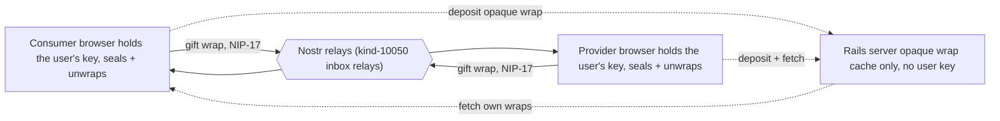
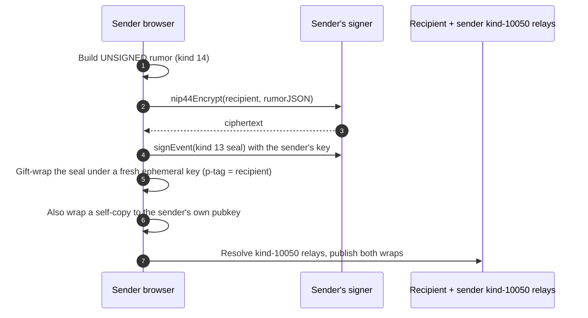
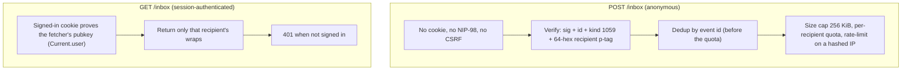
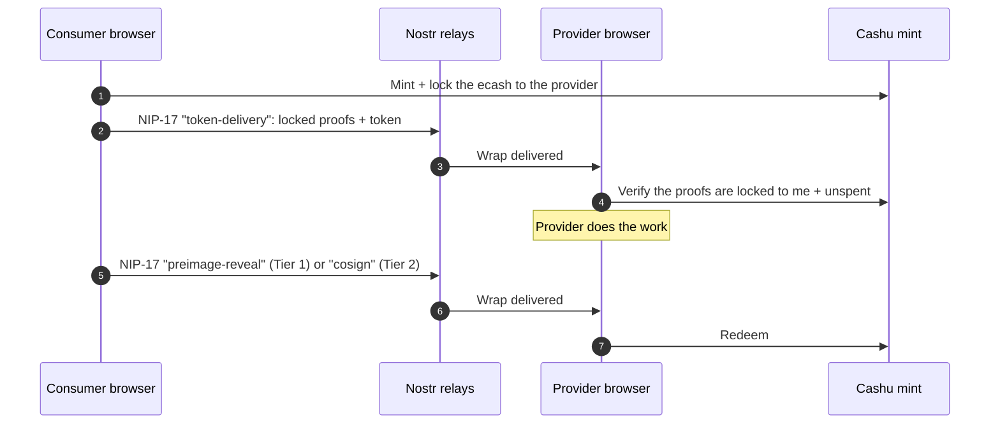

# How private messaging works in Switchboard

**Principle: the server cannot read your messages.** Every private message (order requests, escrow hand-offs, chat) is end-to-end encrypted between the two parties using NIP-17. A user's secret key lives only in the browser, so the crypto runs in the browser even though a byte-compatible Ruby implementation also exists on the server. The server is not a relay, a proxy, or a plaintext message store. At most it caches opaque kind-1059 gift wraps it can never decrypt.

## The pieces



- **Browser (both parties):** holds the user's key (via the signer), seals and gift-wraps outgoing messages, unwraps incoming ones. It is its own Nostr client and talks to relays directly. The entire message path lives here.
- **Nostr relays:** carry the encrypted kind-1059 wraps. Primary delivery is always the recipient's kind-10050 DM inbox relays.
- **Rails server:** serves the app and keeps an optional, opaque cache of gift wraps so a returning user can rebuild its inbox on cold start. It holds no user key, so it can never read a wrap.

## The non-custodial rule

A user's Nostr secret key (`nsec`) never reaches the server. It lives only in the browser, held by the user's signer:

- a **NIP-07** browser extension (`window.nostr`),
- a **NIP-46** remote signer ("bunker"), or
- a pasted **nsec** (optionally saved NIP-49-encrypted in `localStorage`, never in a cookie).

The Rails runtime holds exactly one key of its own: **R_op**, a low-privilege operational identity (`Operational::Signer`, from `R_OP_PRIVATE_KEY`). R_op is never a user key and never holds funds. It signs only platform speech: NIP-42 relay AUTH, R_op's own kind-10050 DM relay list, and its NIP-89 handler announcement (`Operational::Publish`). It never decrypts a message between two users.

## Two key-holders, one protocol

A NIP-17 private message is wrapped per NIP-59 in three nested layers, each encrypted with NIP-44 v2:

```
gift wrap (kind 1059, signed by a fresh EPHEMERAL key)   <- addressed to the recipient (p-tag)
└─ seal  (kind 13, signed by the AUTHOR's real key)      <- encrypted to the recipient
   └─ rumor (kind 14 chat / 15 file, UNSIGNED)           <- the actual message
```

The same protocol is implemented twice, for two different key-holders:

| | Implementation | Holds | Can decrypt |
| --- | --- | --- | --- |
| **Browser** | `app/javascript/nostr/*` | the user's key (via the signer) | wraps addressed to the user |
| **Server** | `app/services/messages/*`, `lib/nip44.rb` | only R_op | nothing in practice (see below) |

This is the crux: **NIP-17 decryption requires the recipient's private key.** A consumer to provider message is sealed by the consumer and addressed to the provider, so:

- **Sending** it needs the consumer's key, present only in the consumer's browser.
- **Reading** it needs the provider's key, present only in the provider's browser.

The server is neither party and holds neither key, so it cannot encrypt or decrypt these messages. The Ruby `Messages::Unwrap` service exists and is byte-compatible with the browser, but it has no production call site that decrypts a user wrap. It is used for cross-testing the interop contract only.

### Why not just do it on the server?

Routing user messages through the server (encrypting and decrypting with a server key) would make the server a plaintext interception point, effectively custodial of message content. That model was considered and rejected (2026-06-04, "minimize/e2e"). The browser is the only place this crypto can run without breaking non-custody.

## What the server does vs never does

The server is **out of the loop** for message content. Concretely, it does **not**:

- read, decrypt, or render any user message or order content (it holds no user key);
- relay or forward messages between users (browser to relay is direct);
- persist message **plaintext** (only opaque kind-1059 wraps are ever stored, as a cold-start cache).

What the server **does** do:

- **Serve the app:** HTML, the importmap JS, the sign-in session, the JSON API.
- **Ingest the public catalog:** a server-side relay client (the R_op client, `lib/nostr_client/*`) subscribes to public, unencrypted kind-30402 service listings and indexes them for search.
- **Act as R_op, and only R_op:** with its one operational key it authenticates to relays (NIP-42) and publishes its own events (kind-10050 DM relay list, NIP-89 handler announcement).
- **Cache opaque wraps:** store kind-1059 wraps for cold-start inbox recovery, never decrypting them (see below).

So there are **two separate Nostr clients** that share the wire format but never the keys: the server-side one (`lib/nostr_client/*`, keyed by R_op, for catalog ingest and R_op's own speech) and the browser one (`app/javascript/nostr/*`, keyed by the user, for private messaging). A user DM never passes through the server-side client, and R_op never touches a user DM.

## Stored vs never seen

- **Stored (opaque, server-side):** the kind-1059 wrap's canonical fields only (recipient p-tag, ephemeral sender pubkey, randomized timestamp, ciphertext, signature), deduped by event id.
- **Never:** user private keys, message plaintext, the seal's author, the rumor, the order request inputs, the escrow token, the preimage. All of that is sealed end-to-end and stays in the browser.

## Send flow (browser)



1. Build the unsigned **rumor** (kind 14, `buildRumor`). `authorPubkey` must be the signer's own pubkey: it is the anti-impersonation anchor.
2. **Seal** it: `signer.nip44Encrypt(recipient, rumorJSON)`, then `signer.signEvent({kind: 13, ...})` with the user's key. The seal has empty tags and a past-randomized `created_at`.
3. **Gift-wrap** it under a fresh single-use ephemeral key (`nip44` encrypt + `finalizeEvent`), p-tagged to the recipient, independently past-randomized.
4. Wrap a **second copy** addressed to the sender's own pubkey, so the message appears in the sender's own thread (NIP-17 requires both, `wrapMessage`).
5. Resolve each recipient's **kind-10050** DM relay list and publish the wraps there (and to the sender's own DM relays).

## Receive flow (browser)

1. Subscribe to `kinds:[1059] #p:<self>` on the user's own DM relays. For AUTH-gated relays the user signs the NIP-42 kind-22242 challenge: the user signs it, not R_op.
2. **Unwrap** each wrap with the user's signer (`app/javascript/nostr/nip17.js`), enforcing every NIP-17/59 invariant:
   - the wrap (1059) and seal (13) are signed, so each gets a full NIP-01 verify (id + sig) then a kind gate;
   - the seal's tags must be empty;
   - the rumor is unsigned, so it is validated directly: NIP-01 typing, a recomputed id, no `sig`, no NUL bytes;
   - `seal.pubkey === rumor.pubkey`, or any sender could forge authorship (NIP-17 anti-impersonation).
3. Render client-side. Decrypted content never returns to Rails. A wrap this signer cannot read, or that violates an invariant, is discarded.

## Cold-start inbox cache

Primary delivery is **always** the recipient's kind-10050 inbox relays; the wraps live there. On top of that, Switchboard keeps an opaque, Switchboard-controlled copy of each wrap (`InboxWrap` + `Messages::StoreWrap` + `InboxController`, routes `GET /inbox` and `POST /inbox`) so a returning user can rebuild its inbox on cold start, and across devices, without waiting on relay availability. It stores **only** kind-1059 wraps and **never** decrypts: the server learns no more than any relay (recipient p-tag, ephemeral sender pubkey, randomized timestamp, ciphertext).

The two halves have deliberately different trust models:



- **Deposit, `POST /inbox`, anonymous.** Like a relay accepting an `EVENT`: no cookie and no NIP-98, so the gift wrap's sender-hiding survives. The wrap is verified (sig + id + kind 1059 + a 64-hex recipient p-tag), stored as its canonical fields only, deduped by event id (before the quota, so a re-deposit is never wedged out), size-capped (256 KiB, `MAX_WRAP_BYTES`), per-recipient quota'd (`PER_RECIPIENT_QUOTA = 10_000`, returning `507 Insufficient Storage` when full, not `422`), and rate-limited on a hashed IP (60 per minute), all identity-free. Retention is the earlier of 30 days (`InboxWrap::RETENTION`) and the wrap's own NIP-40 expiration, swept by a daily `prune_expired` reaper (`reap_expired_inbox_wraps` in `config/recurring.yml`, 3am every day). A session- or NIP-98-authenticated deposit was rejected by design: it would resolve to the sender's real pubkey and bind it (plus IP / user-agent) to the recipient, rebuilding the exact sender to recipient graph NIP-17 exists to destroy. Residual griefing: because the deposit is anonymous, a flood of valid junk wraps p-tagged at a victim can fill that victim's cache quota. Only the cache degrades (new deposits get `507`), never delivery (the wrap still reaches the recipient via their kind-10050 relays). NIP-13 proof-of-work is the anonymity-safe escalation if this is ever abused.
- **Fetch, `GET /inbox`, session-authenticated.** The signed-in cookie already proves the fetcher's pubkey (`Current.user`), so the server returns only that recipient's wraps, no per-request NIP-98 signing needed. Fetch is paged by a composite `created_at|id` keyset cursor (`PAGE_LIMIT = 500`). A JSON consumer gets `401` when not signed in.

**Honest limits.** This HTTP store is reachable only by Switchboard's own browser client. No third-party NIP-17 client (Damus, Amethyst, 0xchat) deposits over HTTP; they all publish to the recipient's kind-10050 relays. So it is a Switchboard to Switchboard convenience cache, not an interoperable delivery path. The interoperable, durable, Switchboard-controlled answer is to run our own recipient-only AUTH-gated inbox relay listed in users' kind-10050 (deferred: fortify `relay_rb`); when that ships, this HTTP store is retired in its favour. One residual leak, named not hidden: the row's wall-clock arrival time (the fetch cursor key) retains timing the randomized 1059 timestamp tries to hide. This is relay-equivalent, bounded by the 30-day retention reaper, and the deposit path neither stores nor logs the source IP (the rate-limit key is a salted hash of the IP, kept transiently in Solid Cache).

## Order requests and escrow ride the same rails

Order coordination is just typed NIP-17 messages, so it inherits the same end-to-end privacy. The server never sees any of it.

- **Order request** (`app/javascript/nostr/order_envelope.js`): the consumer seals the filled service inputs and an optional note to the provider so the work can begin. A kind-14 rumor carrying a JSON body, joined to the listing by an `a` tag, namespaced by the `switchboard-order` subject. The provider decrypts it in the browser (`messages_controller.js`) and trusts it only when the rumor author matches the order's known consumer pubkey: a gift wrap proves who sealed it, not that they own the order.
- **Escrow hand-off** (`app/javascript/nostr/escrow_messages.js`): typed `{orderId, type, data}` messages under the `switchboard-escrow` subject, gift-wrapped consumer to provider (with a self-copy):
  - `token-delivery`: the consumer ships the locked Cashu proofs and token to the provider (`funding_controller.js`).
  - `preimage-reveal`: on approval, the consumer reveals the Tier-1 HTLC preimage so the provider can redeem (`settlement_controller.js`).
  - `cosign`: Tier-2 happy path, the consumer co-signs the locked proofs (1 of the 2-of-3) and sends them to the provider.



The locked token and the preimage travel **only** inside these end-to-end wraps. The Rails runtime never sees the token or the preimage. The server learns the escrow outcome by reading the mint, not by decrypting any message: `Escrow::ReconcileSweepJob` runs a reconcile sweep (`Orders::Reconcile`) that observes mint state and records `released` or `refunded`. See `docs/escrow-architecture.md`.

## Interop contract (browser to Ruby to relays)

A browser-built wrap must be readable by the Ruby spine and by any relay, and vice versa. The two implementations are kept byte-aligned and cross-tested against the same fixture (`test/fixtures/files/nip59.vector.json`, in both directions):

- **Canonical event id:** `sha256(JSON [0, pubkey, created_at, kind, tags, content])` with `&`, `<`, `>` left **literal**. JS `JSON.stringify` (via nostr-tools' `getEventHash` in `nostr/canonical`) matches Ruby's `JSON.generate` (`Events::Actions::ComputeCanonicalId`). An HTML-escaping serializer would silently fail every id check.
- **NIP-44 v2 framing** byte-identical to `lib/nip44.rb`: HKDF-expand over the nonce split 32/12/32, ChaCha20 with a counter-0 IV, HMAC-SHA256 over `nonce || ciphertext`, base64 with padding. Verified against the official NIP-44 v2 test vectors.
- **Plaintext capped at 65535 bytes** (`MAX_PLAINTEXT`): the Ruby spine uses a u16-BE length prefix, so larger payloads are unreadable server-side.
- **Layer shapes:** rumor unsigned with a real `created_at`; seal kind-13 with empty tags and a past-randomized `created_at`; wrap kind-1059 ephemeral-signed, `["p", recipient]`, independently past-randomized.

## Relay transport (browser)

The browser relay layer is built on nostr-tools' low-level `Relay` (not `SimplePool`, not NDK): it exposes user-controllable NIP-42 AUTH (the relay hands a kind-22242 template to our signer and never sees a key), per-event OK-correlation, and reconnection, with a thin hand-rolled manager for the auth-required re-send (NIP-42), kind-10050 resolution, and multi-relay fan-out. The substrate pulls only `@noble`, already used by the pinned `nostr-tools/pure`, so it needs no CSP change.

This is implemented as `app/javascript/nostr/relay_set.js` (the manager) and `dm_client.js` (the DM engine), surfaced at `/dms` (`direct_messages#index`, `dm_client_controller`); the order-scoped thread lives at `/messages` and `/messages/:id` (`messages#index`, `messages_controller`). It is **live-verified**: an env-gated test (`test/system/dm_live_e2e_test.rb`, `SWITCHBOARD_LIVE_E2E=1`) delivers a real gift wrap end to end through `wss://auth.nostr1.com` with real NIP-42 AUTH, publish with the auth-required re-publish, subscribe delivery, and unwrap to plaintext. CI coverage runs against an in-page mock relay; the live test never gates CI.

## Trust boundaries, honestly

- The server can see **metadata** that reaches it (which pubkeys connect, when, and a cached wrap's arrival time), but **not** message content, which is gift-wrapped end-to-end.
- Relays see only kind-1059 wraps (ephemeral sender pubkey, recipient p-tag, ciphertext).
- "Non-custodial" holds for keys, funds, and message content. It is not a claim that the system is fully trustless: relays and, for escrow, the Cashu mint are residual trusted parties.