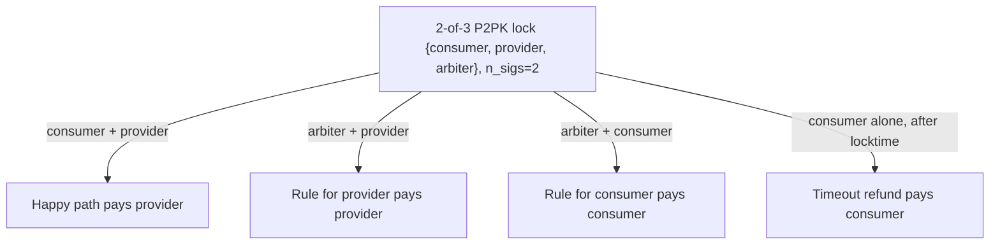
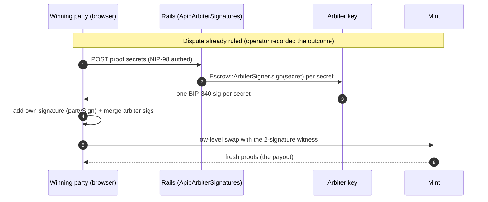
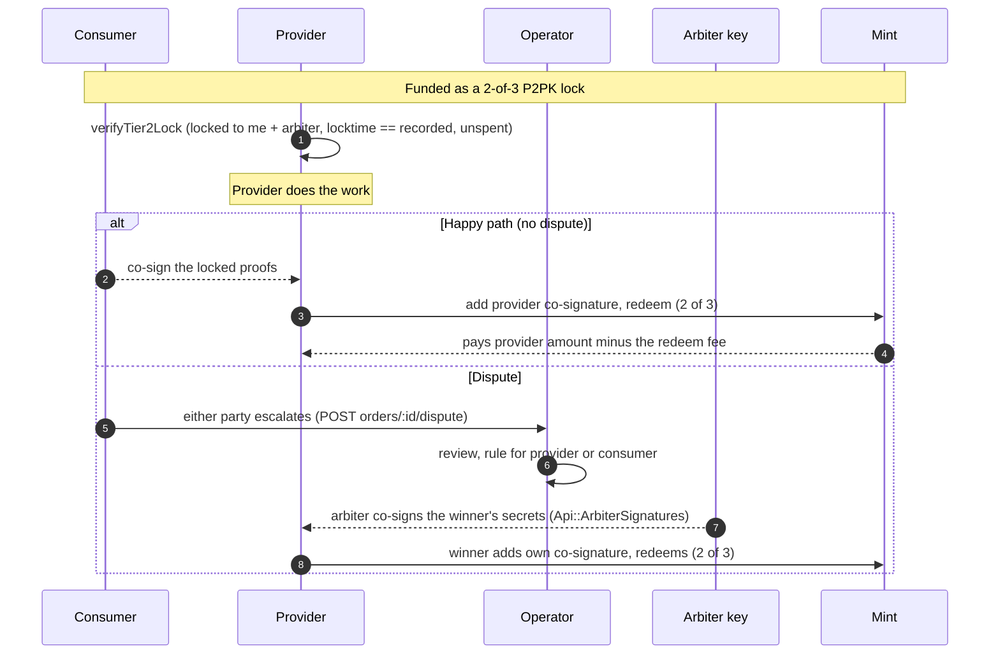
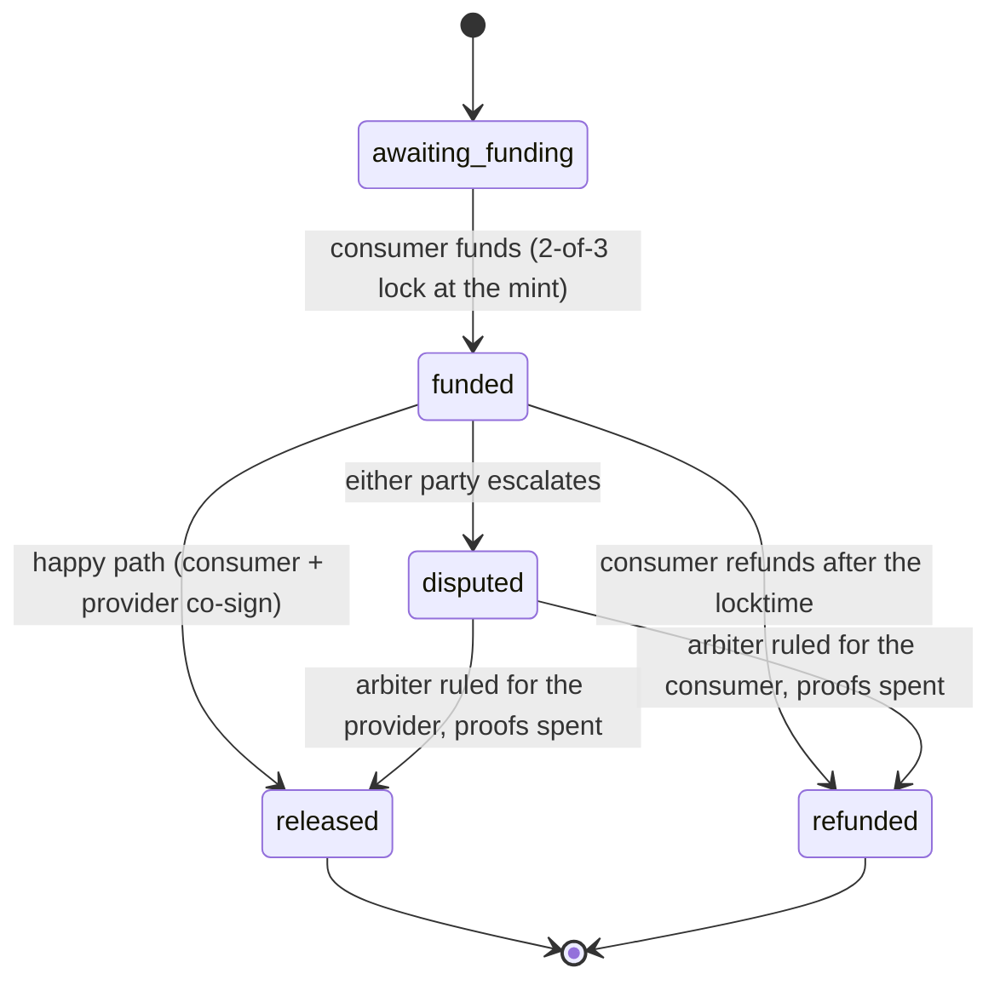
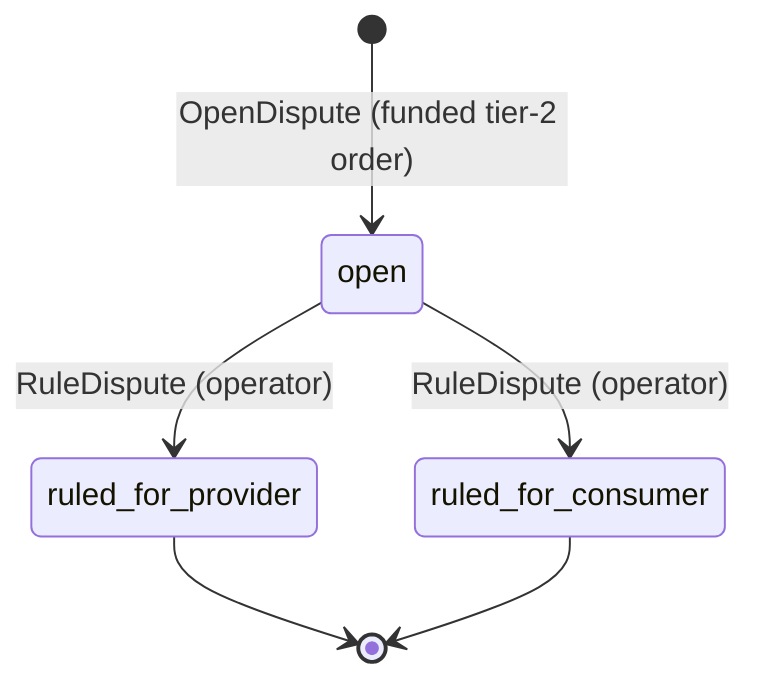

# Tier-2 arbiter escrow (2-of-3 P2PK)

**Principle: a platform arbiter can break a deadlock, but never holds the money and never spends alone.** Tier-2 is an opt-in escrow for subjective work. It locks funds at the mint to a 2-of-3 between the consumer, the provider, and a platform arbiter. Any two of the three release the funds. The arbiter is 1-of-3, never a payee, and never in the refund path, so it stays a signer, not a custodian.

Status: **SHIPPED.** This document is the deep spec. For the overview of how all escrow works (Tier-1 plus Tier-2), see [docs/escrow-architecture.md](escrow-architecture.md).

## Why Tier-2 exists

Tier-1 (NUT-14 HTLC) protects the consumer: they hold the preimage and release at will, and refund themselves after the locktime. Nothing in Tier-1 protects an honest provider from a consumer who takes delivery and refuses to release. Tier-2 closes that gap by adding a mediator who can rule for either side.

- **Tier-1 (HTLC):** consumer-gated, fully self-custodial, no third party. Cap 100,000 sat.
- **Tier-2 (2-of-3 P2PK arbiter):** opt-in for subjective or manual work. Lower cap (25,000 sat) and a longer minimum locktime so a dispute has time to resolve. Default stays Tier-1.

## The lock

A Tier-2 lock is a single NUT-11 **P2PK** proof with **no hashlock** (that is what makes it different from Tier-1's HTLC). The consumer's key is the secret `data` field, the provider and arbiter keys are the `pubkeys` tag, and the refund pathway is the consumer alone after the locktime.

```
["P2PK", {
  "nonce": "<random>",
  "data":  "<consumer_escrow_pubkey>",          // counts as a signer (see below)
  "tags": [
    ["pubkeys", "<provider_escrow_pubkey>", "<platform_arbiter_pubkey>"],
    ["n_sigs", "2"],
    ["locktime", "<unix_seconds>"],
    ["refund", "<consumer_escrow_pubkey>"],
    ["n_sigs_refund", "1"]
  ]
}]
```

**The `data` field counts toward the multisig threshold.** Per NUT-11, the proof is spendable with a valid signature from at least one key in `Secret.data` OR the `pubkeys` tag, so as an n-of-m scheme `m = 1 (data field) + count(pubkeys keys)`. `@cashu/cashu-ts@4.5.1` confirms it: `getP2PKWitnessPubkeys` returns `[data, ...pubkeys]`. So `{data=consumer, pubkeys=[provider, arbiter], n_sigs=2}` is a true 2-of-3 over {consumer, provider, arbiter}.

The builder is in `app/javascript/nostr/cashu_escrow.js` (`lockP2PK2of3`): the first `addLockPubkey(consumerPubkey)` becomes `data`, the next two go to `pubkeys`, `requireLockSignatures(2)` sets `n_sigs`, and `addRefundPubkey(consumerRefundPubkey)` with `lockUntil(locktime)` sets the refund path (`n_sigs_refund` defaults to 1).

## The four spend paths

| Path | Signers | Output goes to | Meaning |
|---|---|---|---|
| Happy | consumer + provider | provider | consumer approved, provider paid |
| Rule-for-provider | arbiter + provider | provider | dispute resolved for the provider |
| Rule-for-consumer | arbiter + consumer | consumer | dispute resolved for the consumer |
| Timeout refund | consumer alone (refund tag, after locktime) | consumer | no dispute resolved in time |

The arbiter (`pubkeys[1]`) is 1-of-3 with `n_sigs=2`, so it can never spend alone. It is not in the `refund` tag, so it can never take part in the timeout refund. The arbiter is structurally a **signer, never a custodian, never a payee**.



## How the funds move

Two signatures from **two different holders** (a party's browser and the platform), so we cannot use `wallet.receive` (which only signs a 2-of-3 when one holder owns both keys). Instead the witness is partial-signed across holders:



1. Holder A signs each proof (`coSignProofs(proofs, keyA)` appends one signature).
2. Holder B signs the partially-signed proofs (appends the second).
3. The final holder submits the now-2-signature inputs via `redeem2of3` (a low-level `wallet.mint.swap`, the same hand-built-witness path Tier-1's `redeemWithPreimage` uses, just with two signatures instead of a preimage).

The **timeout refund** (consumer alone, 1 sig) reuses `wallet.receive(token, {privkey: consumerKey})` because it is single-holder, identical to the Tier-1 `refund`.

`signP2PKProof(proof, privKey)` signs a Schnorr signature over `SHA256(secret)`, the secret string only. It does not need `C` (the mint's unblinded signature), which is what lets the platform sign as arbiter without ever holding a spendable proof.

## The happy path vs a dispute



Before working, the provider verifies the real on-mint lock with `verifyTier2Lock` (`app/javascript/nostr/order_settlement.js`): unspent, summing to the order amount, a 2-of-3 P2PK whose signer set includes both the provider's own key and the platform arbiter, with a refund pathway and a locktime that **equals** the one Rails recorded and is still future. The locktime-equality check is load-bearing: Rails only validates the reported locktime (it cannot read the on-mint secret), so a malicious consumer could lock a near-immediate locktime on the mint while reporting a long one and refund-steal right after delivery. Binding the on-mint locktime to the recorded value closes that.

## Order states

Tier-2 adds a `disputed` state. Tier-1 orders never enter it.



In `app/models/orders/states.rb`: `DISPUTED` is in `ALL` and `ACTIVE` (a disputed order is still open and blocks a re-order), `SETTLEABLE = [FUNDED, DISPUTED]` is the set the reconcile sweep and settlement scan, and the transitions are `FUNDED => [RELEASED, REFUNDED, DISPUTED]` and `DISPUTED => [RELEASED, REFUNDED]`.

## How settlement decides the direction

The mint confirms the proofs are SPENT (the money moved, irreversibly), but for Tier-2 it cannot tell us **who** signed, only **how many**. NUT-07 checkstate returns the witness (signatures used) but not the secret, and Rails only stores `Y = hash_to_curve(secret)` (one-way), so Rails cannot attribute the signatures. A hostile mint could even pad the count. So Tier-2 direction (released vs refunded) cannot be derived from the mint alone. It is anchored on the one fact Rails owns: **the platform arbiter signs only after a ruling** (`Orders::ArbiterSign` gates on `dispute.ruled?`), so an arbiter signature is unobtainable until then.

`Orders::Settlement#arbiter_outcome` (`app/services/orders/settlement.rb`):

- **1-signature spend** -> **REFUNDED.** That is the consumer's timeout refund, always a refund even after a ruling, because the funds demonstrably moved back to the consumer.
- **2-of-3 spend on a ruled dispute** -> the arbiter co-signed for the ruled side: ruled-for-provider is **RELEASED**, ruled-for-consumer is **REFUNDED**.
- **2-of-3 spend with no ruling** -> can only be consumer + provider (the arbiter could not have signed without a ruling), so the consumer authorized the provider: **RELEASED.** A dispute cannot be opened once a release is recorded (`OpenDispute` rejects it), so a ruling never collides with an already-authorized release.

The signature count (1 vs 2-of-3) is the only thing read from the mint, and only to split the timeout-refund path from the rest. The semantic outcome is always anchored in a Rails-side record we authenticate ourselves. Settlement runs for funded OR disputed orders (`States::SETTLEABLE`), and only once every proof shows spent (the spend is atomic, so a partial state means wait).

## The trust model (disclosed honestly)

A pure 2-of-3 means **arbiter + provider can release to the provider before locktime, without the consumer and without proof of delivery.** This is inherent and intended, not a defect: it is exactly the power that lets a mediator pay an honest provider when a dishonest consumer withholds. A hybrid that required the consumer's preimage for any release would remove the arbiter's ability to ever rule for the provider, deleting the reason Tier-2 exists. So pure 2-of-3 is the correct design.

The protection is therefore not cryptographic. It is:

1. **The arbiter is the platform itself**, reputation-bound, 1-of-3 (never sufficient alone), and structurally never a payee. A platform has no incentive to burn its reputation colluding with a random provider over one small escrow.
2. **Tier-2 is opt-in**, for subjective work, with a conservative per-order cap (lower than Tier-1).
3. **Honest disclosure** in the funding UI: a platform arbiter can mediate disputes, you are trusting the platform not to collude with the provider, use Tier-1 (self-release) for objective deliverables.

This is the standard 2-of-3 escrow trust model (cf. Bitcoin escrow, `cashu-escrow-kit`, `scrow`).

### The locktime-lead nuance (accepted limitation)

The refund pathway is **additive**, not exclusive. Per the spec, the multisig conditions continue to apply and **in addition** the proof can be spent by the refund key after the locktime. So once the locktime passes, both the 2-of-3 and the consumer's 1-of-1 refund are live, and first-spend-wins.

Consequence: a consumer who **loses** a ruled-for-provider dispute can still reclaim the funds with a 1-of-1 refund **once the locktime passes**, so the provider must complete the 2-of-3 redeem (provider + arbiter) before then. This is the trust model, not a settlement bug: `Settlement#arbiter_outcome` correctly labels a 1-sig spend REFUNDED even after a ruling, because that tracks where the money actually went.

The mitigation is operational, not cryptographic:

- A **minimum locktime lead** (`tier2_min_locktime_seconds`, default 259,200 = 3 days) so a dispute has time to resolve before the consumer's unilateral refund window opens. Enforced in `FundingContract` (the reported locktime must be at least `Policy.tier2_min_locktime` out) and re-asserted by the provider's on-mint locktime check.
- The provider is driven to redeem promptly after a ruling.

A cryptographic fix (gating the refund on an arbiter co-sign once disputed) is a lock-design change deferred post-MVP.

## What the server stores vs never sees

For a Tier-2 lock, Rails stores the same class of observable data as Tier-1.

- **Stored (observable, non-spendable):** lock terms (`mint_url`, `lock_pubkey`, `arbiter_pubkey`, `refund_pubkey`, `required_signatures`, `required_refund_signatures`, `locktime`, `amount_sats`) and the proof `Y` values. The dispute record (who opened it, an optional reason, the ruling status and time).
- **Never:** the proof secret, nonce, `C`, a spendable proof, or any private key. All of that stays in the browser. The arbiter signature is produced on demand at ruling time and handed to the winning party, never stored (`OrderDispute`, `OrderLock` model comments).

## The platform arbiter key

`Escrow::ArbiterSigner` (`app/services/escrow/arbiter_signer.rb`) holds a **dedicated** secp256k1 Cashu key, read from `ESCROW_TIER2_ARBITER_PRIVKEY` (64-hex), with a private reader so it cannot leak. It is a different key from `R_OP_PRIVATE_KEY`: R_op signs Nostr events, the arbiter signs Cashu proof secrets. Different usage, cleaner separation.

- `configured?` gates whether Tier-2 is offered or fundable at all (a Tier-2 order cannot be funded unless the key is provisioned).
- `pubkey` is the compressed (SEC1, 66-hex) point the consumer locks to, advertised to the browser. It matches cashu-ts `getPubKeyFromPrivKey` for the same key (cross-language tested).
- `sign(secret)` returns a BIP-340 Schnorr signature over `SHA256(secret)` as the 128-hex witness signature the mint verifies, matching cashu-ts `signP2PKProof`.

Implementation note (the hex-mangling gotcha): `sign` passes the **64-hex key string** and the **32-byte binary digest** to `Schnorr.sign`. bip-schnorr hex-detects its inputs, so a binary key whose bytes are all ASCII hex would be re-parsed as hex and mangled to the wrong scalar. Passing hex-key plus binary-message sidesteps that.

Because the arbiter signs the secret only (never sees `C`), is 1-of-3 (cannot spend even while transiently holding a secret), is never in the refund set, and the swap output is always chosen by the party, the arbiter is a signer-not-custodian by construction.

## The anti-bypass: validate, do not inject

Because `data` counts as a signer, a consumer who supplied `arbiter = their own second key` would hold 2-of-3 and could drain the lock unilaterally (escrow becomes fake). So the arbiter key **must equal** the platform's published arbiter pubkey.

Rails **validates** this, it does not inject it. The lock already exists at the mint by the time Rails sees the funding report, and Rails cannot read the on-mint secret, so overwriting the reported `arbiter_pubkey` with the platform key would only **hide** a mismatch. An honestly-reported wrong arbiter must be **rejected** (so the consumer re-locks correctly), not silently rewritten.

Defense-in-depth is two server-side layers:

- `app/contracts/orders/funding_contract.rb`: for Tier-2, `hashlock` must be absent, `arbiter_pubkey` required and `== Escrow::ArbiterSigner.pubkey`, `required_signatures == 2`, `required_refund_signatures == 1`, and the locktime at least `tier2_min_locktime` out. For Tier-1, `hashlock` required and `arbiter_pubkey` absent.
- `OrderLock` model (`tier_lock_shape` validation): a direct create cannot bypass the contract. Tier-2 must carry the platform arbiter and no hashlock; Tier-1 must carry a hashlock and no arbiter. Backed by DB check constraints (`order_locks_arbiter_pubkey_point` and `order_locks_hashlock_hex`, the latter being `hashlock IS NULL OR hashlock ~ '^[0-9a-f]{64}$'` so a Tier-2 lock may omit the hashlock).

`Orders::Funding` omits `hashlock` for Tier-2, sets `required_signatures = 2`, and passes the full terms (nils included) so a missing key triggers a contract failure rather than being silently skipped.

The residual risk (a consumer who **lies**, locking to a non-platform arbiter on the mint but reporting the platform key) is bounded: they only risk their own refundable funds, and the **provider independently verifies the real on-mint 2-of-3 carries the platform arbiter before working** (`verifyTier2Lock`), which is the true backstop.

## The dispute lifecycle



Disputes (`OrderDispute`, one per order, DB `UNIQUE(order_id)`) move through `open -> ruled_for_provider | ruled_for_consumer` (`app/models/orders/dispute_statuses.rb`).

- **`Orders::OpenDispute`:** either party (consumer or provider) opens a dispute on a **funded Tier-2** order. It records the dispute and transitions `funded -> disputed` atomically, idempotent. It rejects Tier-1 orders, non-parties, non-funded orders, and any order whose release was already recorded (`order.release.present?`).
- **`Orders::RuleDispute`:** the platform operator rules for one party. Under a row lock it records `status` and `ruled_at` and **nothing more**: it does not move the order and it does not sign. Re-ruling the same way is a no-op; flipping to the other party is rejected (funds may already be moving on the first ruling). The `disputed -> released | refunded` transition lands later, when the reconcile sweep confirms the proofs SPENT and the ruling supplies the direction.
- **`Orders::ArbiterSign`:** the winning party fetches the arbiter's detached signatures afterward. A secret is signed only when every gate holds: the order is a disputed, ruled Tier-2 order; the caller is the party the ruling favors (provider on ruled-for-provider, consumer on ruled-for-consumer); and each submitted secret hashes (NUT-00 `hash_to_curve`) to one of THIS order's recorded proof `Y` values (so a winner cannot harvest signatures for a different shared order). No more secrets than the order has proofs. Any failed gate raises `AuthorizationError`, so the caller learns nothing about which gate failed. Returns one 128-hex signature per secret, in order.

### The arbiter signing channel

The winning party fetches signatures over an authenticated HTTP endpoint: `POST /api/orders/:order_id/arbiter_signatures` (`Api::ArbiterSignaturesController`, NIP-98 authed, stateless JSON, kept off the Turbo `OrdersController`). The caller submits the proof secrets and receives one BIP-340 signature per secret. Every non-entitled case is an opaque 403. The server signs only secrets bound to this order's proofs and only for the ruling's winner; it signs the secret only, persists nothing, and never sees `C`.

### Controllers and routes

- `POST orders/:id/dispute` -> `OrdersController#dispute` (either party escalates; `require_login` + `rate_limit`).
- `POST orders/:order_id/arbiter_signatures` -> `Api::ArbiterSignaturesController#create` (the winner fetches signatures).
- `admin/disputes` (index + member `rule`) -> `Admin::DisputesController`, the operator ruling queue (`OrderDispute.awaiting_ruling`). It is **`OPERATOR_PUBKEYS`-gated** (a Nostr login, not a role). Ruling is HTML/Turbo; the arbiter signing that completes the spend is the party's own JSON call.

## Funding and settlement (server)

- `app/services/orders/funding.rb`: records the reported lock and moves to funded. Tier-2 omits `hashlock`, validates (does not inject) the arbiter key, and refuses to fund unless `Escrow::ArbiterSigner.configured?`.
- `app/services/orders/settlement.rb`: forks on `order.tier`. Tier-1 keeps the preimage-match logic; Tier-2 uses the records-anchored direction above. The settleable guard is `States::SETTLEABLE.include?(current_state)` (funded or disputed), not just funded.
- `app/services/orders/reconcile.rb` and the reconcile sweep scan `States::SETTLEABLE`, so a disputed order whose proofs the arbiter + party spent is detected and settled.

## Config and limits

In `config/initializers/escrow.rb` (Tier-2 reads through `Orders::Policy`):

| Key | Env var | Default |
|---|---|---|
| Tier-2 per-order cap | `ESCROW_TIER2_MAX_ORDER_SATS` | 25,000 sat |
| Tier-2 minimum locktime lead | `ESCROW_TIER2_MIN_LOCKTIME_SECONDS` | 259,200 (3 days) |
| Arbiter private key | `ESCROW_TIER2_ARBITER_PRIVKEY` | (required to offer Tier-2) |

For reference, the Tier-1 cap is `ESCROW_MAX_ORDER_SATS` (100,000 sat). `Policy.cap_for(tier)` returns the Tier-2 cap for `tier2_arbiter`, otherwise the Tier-1 cap.

## Where Tier-2 is offered (UI)

Tier-2 is opt-in at order placement. A provider's listing (or an open request) indicates Tier-2 eligibility for subjective work; the consumer's order or claim form offers a Tier-1 (self-release) vs Tier-2 (mediated) choice with the honest disclosure above. `Orders::Place` carries `tier`, and the per-tier cap is applied in the placement path (`CreateContract` and the `Order` model, via `Policy.cap_for`). Default stays Tier-1.

## Post-MVP / future improvements

- **Consumer-nominated arbiters.** Let the consumer pick an arbiter from a vetted allowlist of third-party arbiters at funding, instead of always the platform. The Tier-2 wire format already supports it (the `arbiter_pubkey` is just a different key); the work is an arbiter registry plus discovery (likely a Nostr announcement / NIP-89-style handler), per-arbiter reputation, a generalized signing channel, and an arbiter-selection step. The anti-bypass gate would then become "`arbiter_pubkey` in the vetted allowlist" rather than "== the platform key."
- **Arbiter bonds / slashing.** Bond the arbiter so misbehavior is punishable (cf. `scrow`). Out of MVP scope (the platform's reputation is the MVP bond), a natural addition once third-party arbiters exist.
- **Cryptographic refund gating.** Gate the post-locktime refund on an arbiter co-sign once a dispute is open, removing the post-ruling front-run window. A lock-design change, deferred.

## Source citations

- **NUT-10/11/14 canonical:** `https://raw.githubusercontent.com/cashubtc/nuts/main/{10,11,14}.md` (`m = 1 (data field) + count(pubkeys)`; additive refund pathway; SIG_INPUTS default).
- **`@cashu/cashu-ts@4.5.1`:** `src/crypto/NUT11.ts` (`getP2PKWitnessPubkeys = [data, ...pubkeys]`, `signP2PKProof`), `src/wallet/P2PKBuilder.ts`, `src/wallet/Wallet.ts`. The P2PK crypto is internal (uses `@noble/curves` schnorr).
- **Prior art:** `f321x/cashu-escrow-kit` (same 2-of-3 shape), `storopoli/scrow` (Taproot 2-of-3 + asymmetric dispute scripts), Mostro (Lightning hold-invoice arbiter).
- **Repo:**
  - Ruby: `app/services/escrow/arbiter_signer.rb`, `app/services/orders/{arbiter_sign,settlement,funding,open_dispute,rule_dispute,reconcile,place}.rb`, `app/models/orders/{states,tiers,dispute_statuses,policy,state_machine}.rb`, `app/models/{order,order_lock,order_dispute,order_release}.rb`, `app/contracts/orders/funding_contract.rb`, `app/controllers/api/arbiter_signatures_controller.rb`, `app/controllers/admin/disputes_controller.rb`, `config/initializers/escrow.rb`.
  - JS: `app/javascript/nostr/{cashu_escrow,order_funding,order_settlement}.js`.